# Simulador 3D – Three.js

## Objetivo del proyecto
Desarrollar una página web interactiva que permita visualizar y manipular objetos 3D, aplicando técnicas de relleno de polígonos, iluminación, sombreado y transformaciones geométricas utilizando Three.js.

## Tecnologías utilizadas
- HTML5  
- CSS3  
- JavaScript  
- Three.js (CDN)

## Instrucciones de uso
1. Abrir el archivo `index.html` en un navegador web moderno.
2. Utilizar los botones para agregar un objeto 3D (cubo, esfera o cilindro).
3. Aplicar opciones de relleno, iluminación y sombreado desde la interfaz.
4. Manipular el objeto usando los controles de rotación, traslación y escala.
5. Activar o desactivar las luces y observar los cambios visuales.

## Capturas de pantalla

### Relleno de polígonos

**Color sólido**
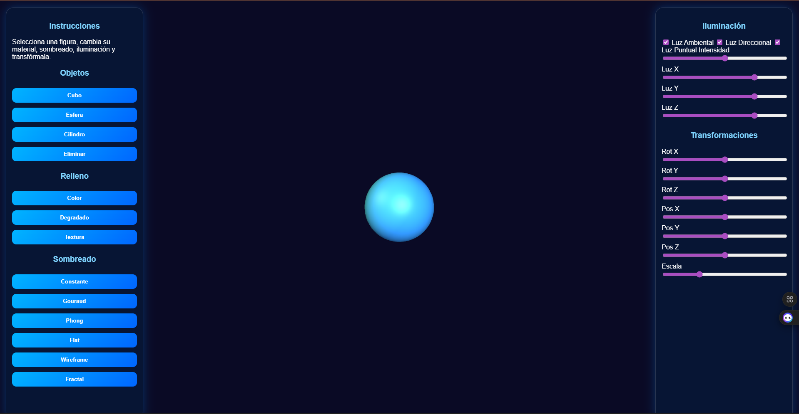
**Color degradado**
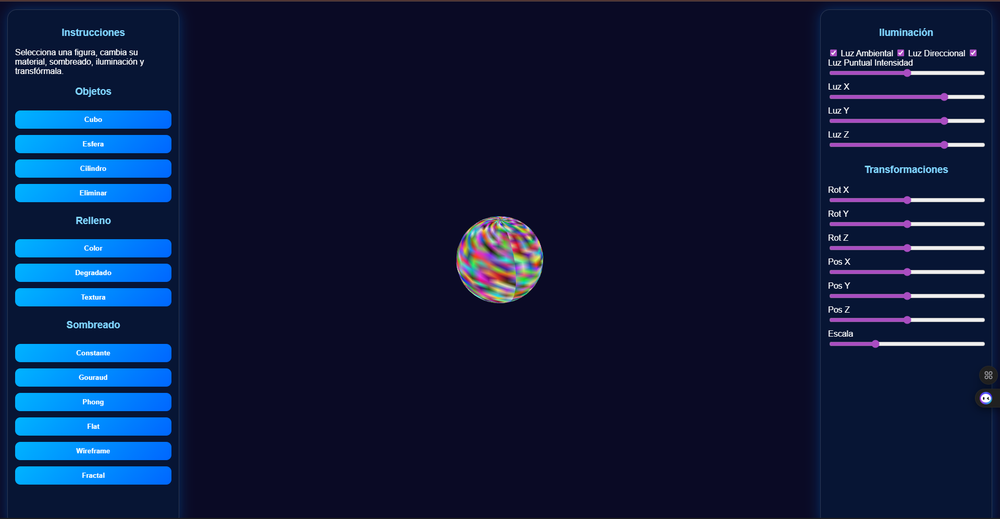
**Material con textura (agua)**
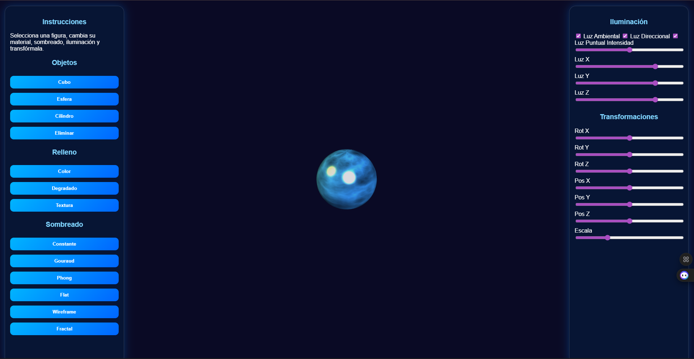

### Iluminación

**Iluminación ambiental**
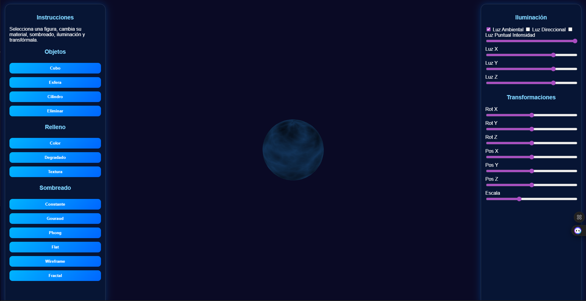
**Iluminación direccional**
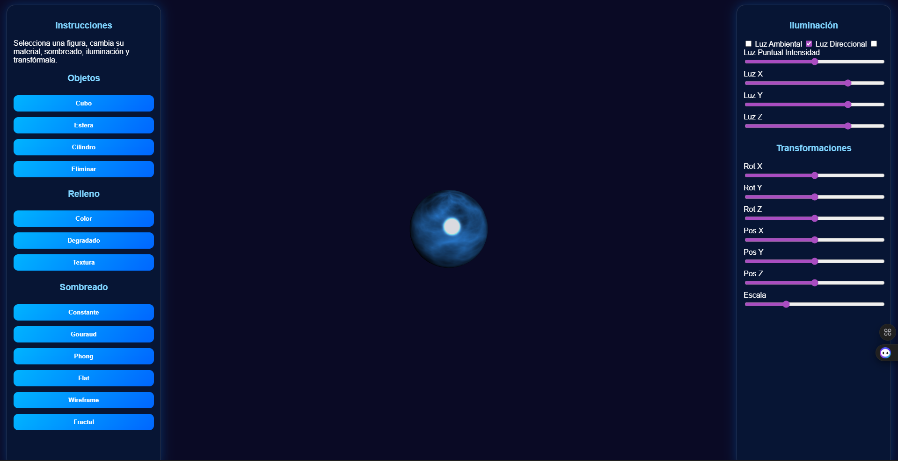
**Iluminación puntual**
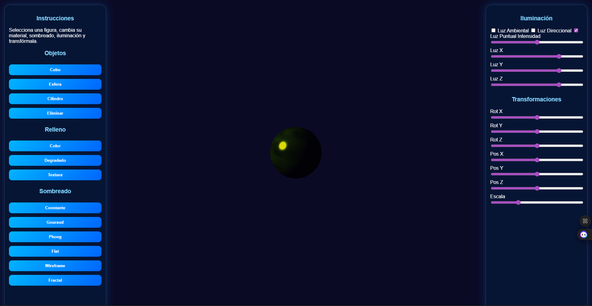

### Técnicas de sombreado

**Sombreado constante**
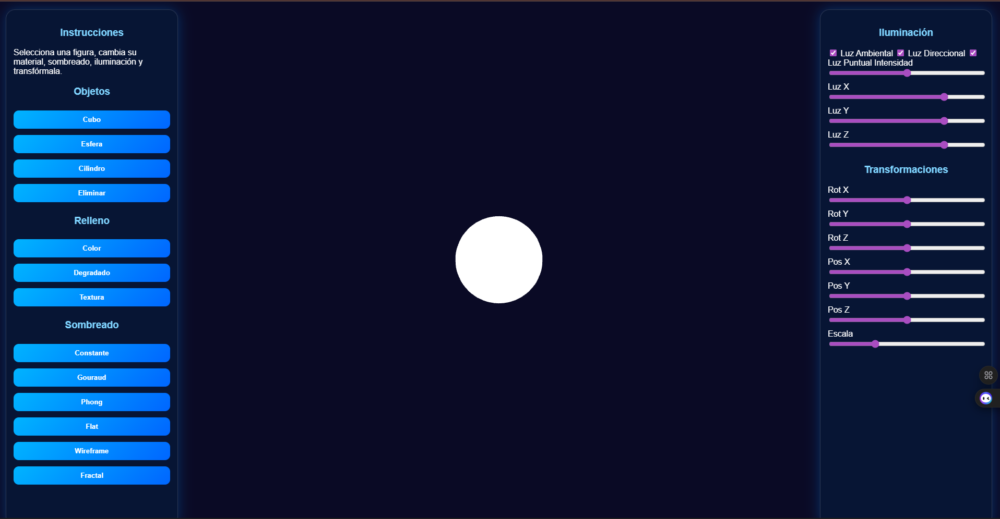
**Flat shading**
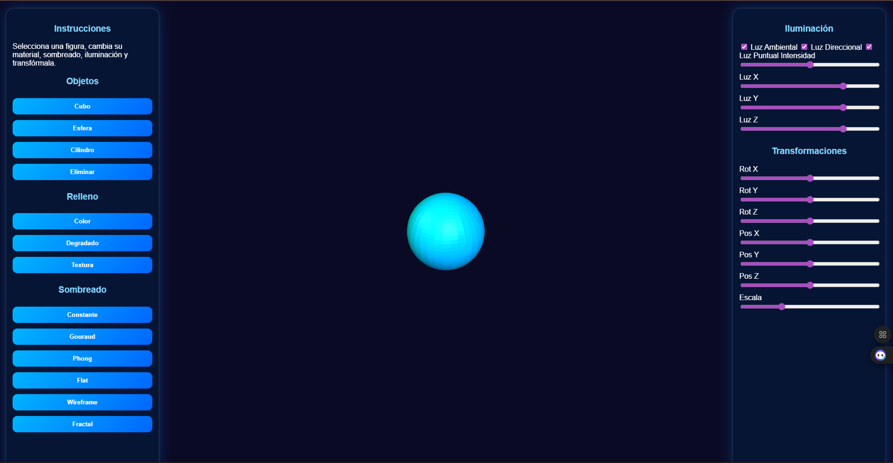
**Gouraud**
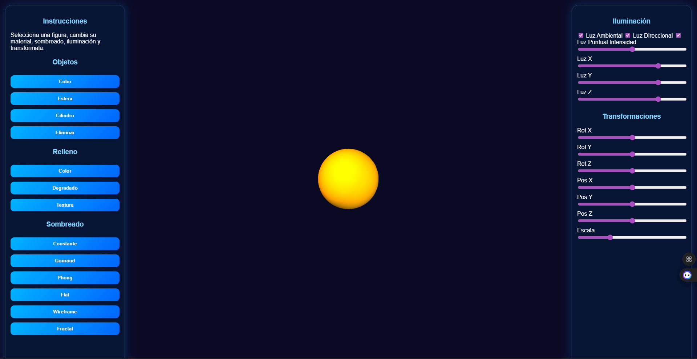
**Phong**
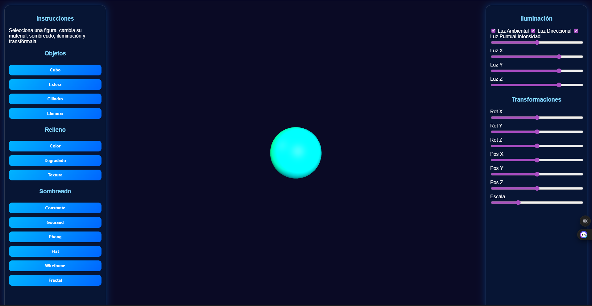
**Shader fractal**
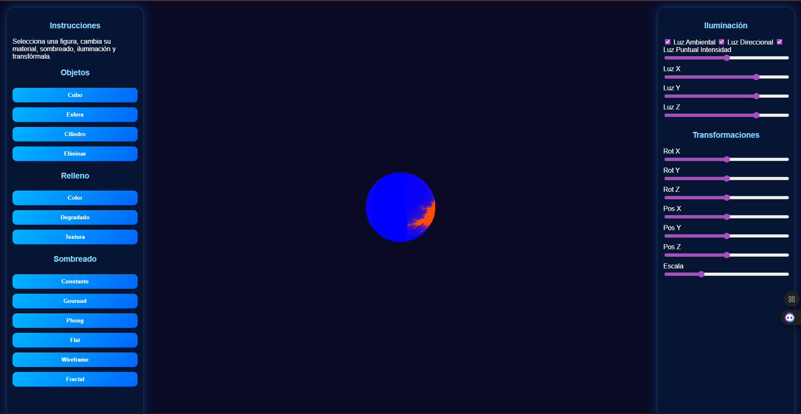
**Wireframe**
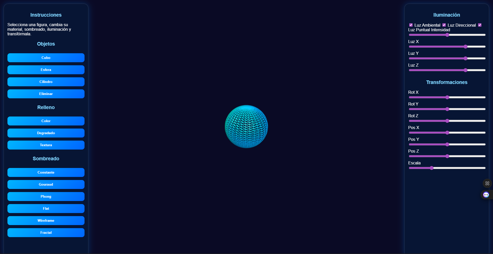

## Funcionalidades principales
- Creación de objetos 3D básicos.
- Relleno de polígonos con color homogéneo, degradado y textura.
- Iluminación ambiental, direccional y puntual ajustable.
- Técnicas de sombreado: constante, Gouraud, Phong, flat shading, wireframe y fractal.
- Transformaciones geométricas del modelo.
- Interfaz gráfica interactiva.

## Integrantes del equipo
-Brandon Emilio Gonzalez Perez – Desarrollo y lógica 3D
    -Implementación de la escena 3D en Three.js.
    -Creación y control de objetos 3D.
    -Programación de las técnicas de relleno, iluminación y sombreado.
    -Implementación de las transformaciones geométricas.
    -Corrección de errores y pruebas funcionales.

-Samantha Shalom Herrera Martinez – Interfaz y documentación
    -Diseño y organización de la interfaz gráfica (botones, sliders y controles).
    -Integración de la interfaz con la lógica del sistema.
    -Elaboración del README del proyecto.
    -Redacción del informe técnico.
    -Apoyo en pruebas y validación del funcionamiento general.

## Instalación de librerías
El proyecto utiliza Three.js mediante CDN, por lo que no es necesaria la instalación de dependencias adicionales.

## Video demostrativo
Enlace al video donde se muestran todas las funcionalidades del simulador
🔗 https://youtu.be/dBesrFV9RME?si=-KLTT1jiiyGlzvi_
